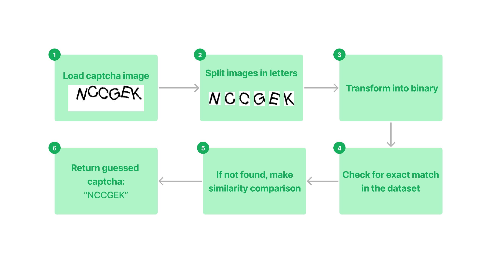

# Rust Amazon Captcha Solver

[](https://crates.io/crates/amazon-captcha-rs)

An attempt to resolve Amazon.com captchas without using Tesseract OCR. Highly inspired by [gopkg-dev/amazoncaptcha](https://github.com/gopkg-dev/amazoncaptcha) and [a-maliarov/amazoncaptcha](https://github.com/a-maliarov/amazoncaptcha). We reuse the dataset from the Go library but in an uncompressed bincode format.

We have simplified the resolving process as much as possible, resulting in a library with less than 200 LoC. In terms of speed, in a release build on an M1 Mac, loading the library takes approximately 30ms (dataset loading), and resolving a captcha takes about 40ms.

## Functional Schema


> Amazon captchas are quite repetitive, with letters always being less than 32 pixels, and there are not millions of possible combinations. The `dataset.bin` contains most of the possibilities. When a letter does not match exactly, we use a similarity comparison function.

## Example
```rs
use amazon_captcha_rs::new_solver; 

let image = image::open("testdata/caggpa.jpg").unwrap();

let solver = new_solver();
let response = solver.resolve_image(&image).unwrap();

assert_eq!(response, "caggpa");
```

## Precision
We downloaded and resolved 100 captchas in the `examples` directory to test the precision. Currently, it's not perfect, mostly due to some images being cropped incorrectly:

```
Solved: 64/99
Precision: 64.65%
```